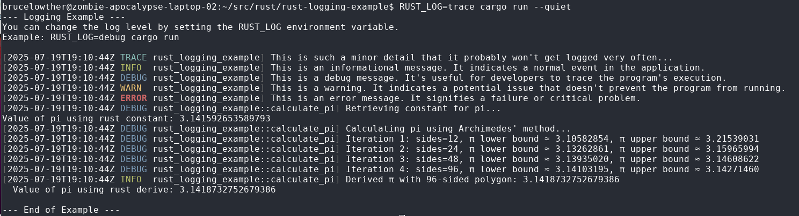

# Logging
Logging is a mechanism add information to a program that will be emitted when the program is run.  Logging functions to some extent exist in almost all programming languages.
Generally I find that logging is not taught very well in school.  Logging is a necessity of complex software execution and generally isn't considered important in academia.

This rust program demonstrates basic logging capabilites that are available in rust.  As mentoned above, these capabilities are available in most languages.  I'm using rust here because I've been learning rust.

# Exercises
1) build the program (debug)
```bash
cargo build
```
You should see some output on the build command:
```text
$ cargo build
   Compiling memchr v2.7.5
   Compiling regex-syntax v0.8.5
   Compiling utf8parse v0.2.2
   Compiling anstyle v1.0.11
   Compiling colorchoice v1.0.4
   Compiling is_terminal_polyfill v1.70.1
   Compiling log v0.4.27
   Compiling anstyle-query v1.1.3
   Compiling jiff v0.2.15
   Compiling anstyle-parse v0.2.7
   Compiling anstream v0.6.19
   Compiling aho-corasick v1.1.3
   Compiling regex-automata v0.4.9
   Compiling regex v1.11.1
   Compiling env_filter v0.1.3
   Compiling env_logger v0.11.8
   Compiling rust-logging-example v0.1.0 (/home/brucelowther/src/rust/rust-logging-example)
    Finished `dev` profile [unoptimized + debuginfo] target(s) in 3.39s
```
Now that we know the binary build successfull, you can run the command with the `cargo run` command.  I'm including the `--quiet` option to remove cargo related output.

1) run the program and observe output:
```bash
$ cargo run --quiet
```
Output should look something like this:
```text
$ cargo run --quiet
--- Logging Example ---
You can change the log level by setting the RUST_LOG environment variable.
Example: RUST_LOG=debug cargo run

[2025-07-19T19:04:01Z ERROR rust_logging_example] This is an error message. It signifies a failure or critical problem.
Value of pi using rust constant: 3.141592653589793
  Value of pi using rust derive: 3.1418732752679386

--- End of Example ---
```
By default, if no `RUST_LOG` parameter is provided, the log level is set to `ERROR` so anything as critical as `ERROR` ore more critical would be printed.  See the reference section for more information on logging levels.


2) Ok, now run with `RUST_LOG=debug` detailed information
```text
$ RUST_LOG=debug cargo run --quiet
--- Logging Example ---
You can change the log level by setting the RUST_LOG environment variable.
Example: RUST_LOG=debug cargo run

[2025-07-19T19:05:26Z INFO  rust_logging_example] This is an informational message. It indicates a normal event in the application.
[2025-07-19T19:05:26Z DEBUG rust_logging_example] This is a debug message. It's useful for developers to trace the program's execution.
[2025-07-19T19:05:26Z WARN  rust_logging_example] This is a warning. It indicates a potential issue that doesn't prevent the program from running.
[2025-07-19T19:05:26Z ERROR rust_logging_example] This is an error message. It signifies a failure or critical problem.
[2025-07-19T19:05:26Z DEBUG rust_logging_example::calculate_pi] Retrieving constant for pi...
Value of pi using rust constant: 3.141592653589793
[2025-07-19T19:05:26Z DEBUG rust_logging_example::calculate_pi] Calculating pi using Archimedes' method...
[2025-07-19T19:05:26Z DEBUG rust_logging_example::calculate_pi] Iteration 1: sides=12, π lower bound ≈ 3.10582854, π upper bound ≈ 3.21539031
[2025-07-19T19:05:26Z DEBUG rust_logging_example::calculate_pi] Iteration 2: sides=24, π lower bound ≈ 3.13262861, π upper bound ≈ 3.15965994
[2025-07-19T19:05:26Z DEBUG rust_logging_example::calculate_pi] Iteration 3: sides=48, π lower bound ≈ 3.13935020, π upper bound ≈ 3.14608622
[2025-07-19T19:05:26Z DEBUG rust_logging_example::calculate_pi] Iteration 4: sides=96, π lower bound ≈ 3.14103195, π upper bound ≈ 3.14271460
[2025-07-19T19:05:26Z INFO  rust_logging_example::calculate_pi] Derived π with 96-sided polygon: 3.1418732752679386
  Value of pi using rust derive: 3.1418732752679386

--- End of Example ---
```
Two things to observe here.  
* Since we set the log level to 'debug' we are seeing logs that are more critical up to the `debug` level.  This is why 'INFO' logs are reported. 
* Notice the name of the thing that is being logged.  Logs are coming from the `rust_logging_example` main. Logs are also coming from the module `calcualte_pi`.

3) Ok, now run with `RUST_LOG=trace`.  What is the difference between the `debug` level and the `trace` level?



# Reference
[Log level info](https://docs.rs/log/latest/log/enum.LevelFilter.html)
[Log level package details](https://docs.rs/log/latest/log/enum.Level.html)